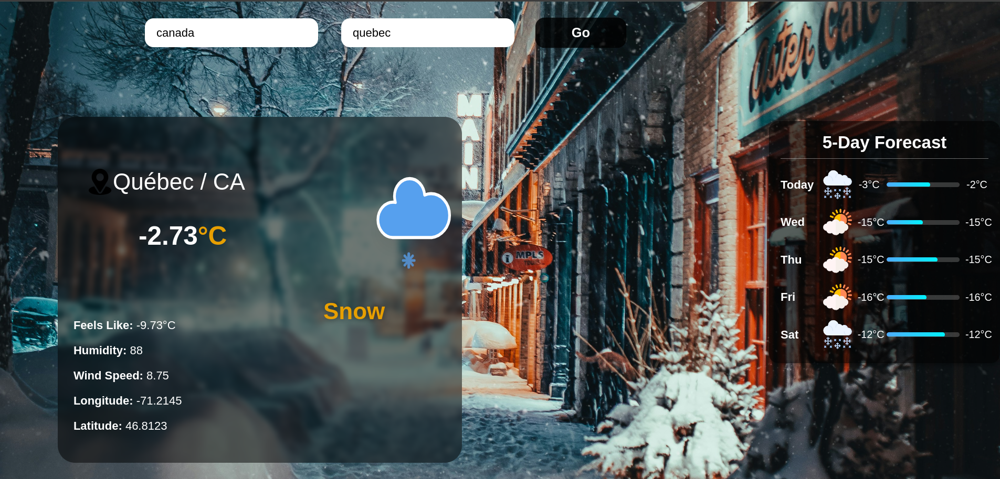
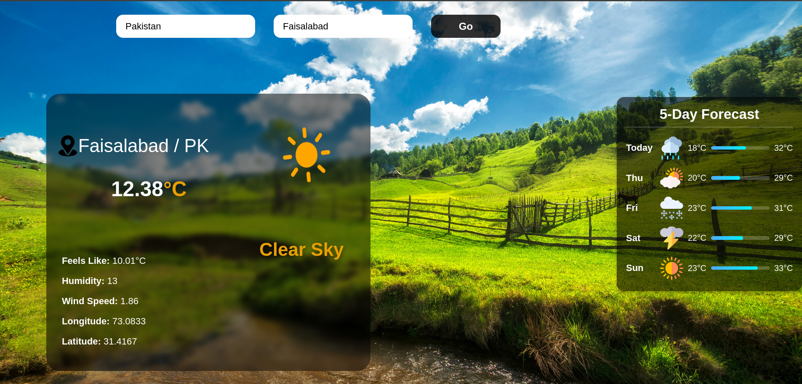
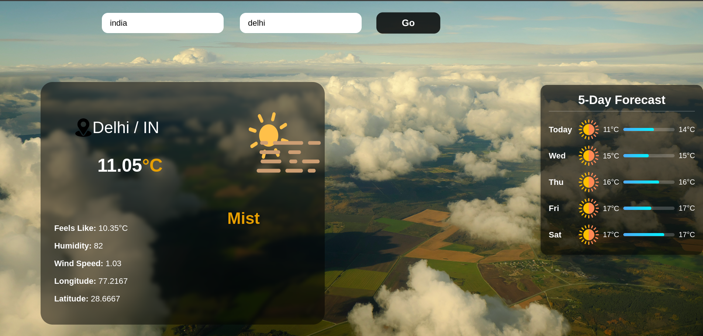
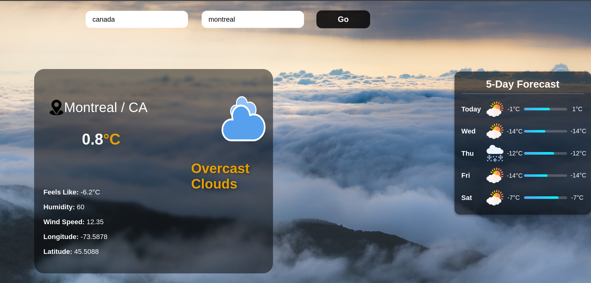

# 🌤️ Django Weather Website  

Welcome to my **Django Weather Website**, a dynamic weather app built using the **OpenWeather API**! This project showcases real-time weather updates, a 5-day forecast, and an engaging interface with dynamic background changes based on weather conditions. 🌈  

## ✨ Features  
- **Real-Time Weather Updates**: Fetches accurate and up-to-date weather data for any city.  
- **5-Day Weather Forecast**: Plan ahead with detailed forecasts for the next 5 days.  
- **Dynamic Backgrounds**: The background changes based on the weather, creating a visually appealing experience.  

## 🛠️ Technologies Used  
- **Django**: For backend development.  
- **OpenWeather API**: For fetching weather data.  
- **HTML/CSS**: For building the user interface.  

## 📸 Preview  





  

## 🚀 How to Run the Project  
1. Clone this repository:  
   ```bash
   git clone https://github.com/Maarij-Aqeel/Weather-Forecast-Django.git
   cd Weather-Forecast-Django
   python manage.py runserver

